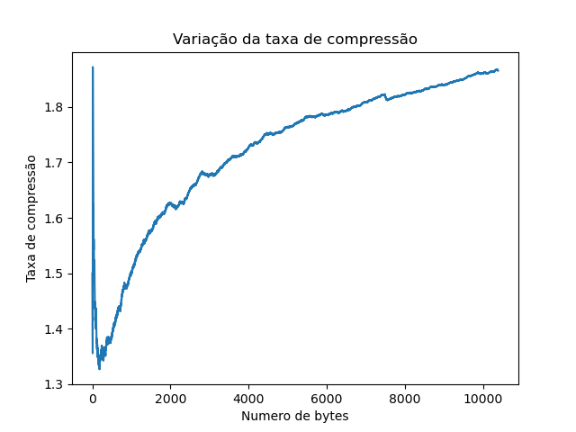

# Relatório dos testes no arquivo Compressao variavel 12 - wiki aleatoria
    
## Tabela dos dados
    
| Descrições | Estatísticas |
| --- | --- |
| Quantidade de valores | 10383 |
| Tempo de execução em segundos | 0.12 |
| Espaço gasto na árvore em kb | 1200.72 |
| Numero total de nós | 21956 |
| Numero de elementos adicionados | 4096 |
| Taxa final de compressão/descompressão | 1.87 |

    
## Gráfico da taxa de compressão
    

    