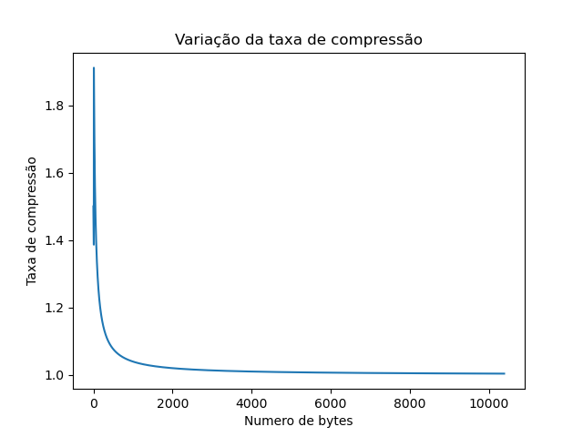

# Relatório dos testes no arquivo Compressao variavel 8 - wiki aleatoria
    
## Tabela dos dados
    
| Descrições | Estatísticas |
| --- | --- |
| Quantidade de valores | 10383 |
| Tempo de execução em segundos | 0.11 |
| Espaço gasto na árvore em kb | 27.95 |
| Numero total de nós | 511 |
| Numero de elementos adicionados | 256 |
| Taxa final de compressão/descompressão | 1.00 |

    
## Gráfico da taxa de compressão
    

    