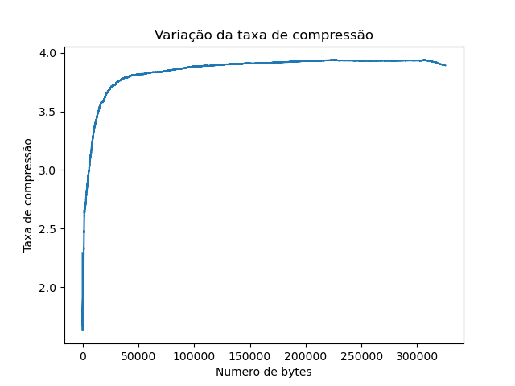

# Relatório dos testes no arquivo Compressao fixa 12 livro
    
## Tabela dos dados
    
| Descrições | Estatísticas |
| --- | --- |
| Quantidade de valores | 325216 |
| Tempo de execução em segundos | 15.67 |
| Espaço gasto na árvore em kb | 1177.09 |
| Numero total de nós | 21524 |
| Numero de elementos adicionados | 4096 |
| Taxa final de compressão/descompressão | 3.89 |

    
## Gráfico da taxa de compressão
    

    