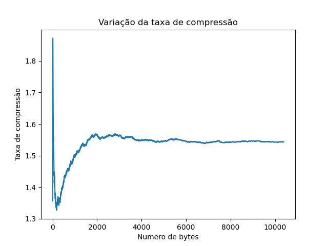

# Relatório dos testes no arquivo Compressao variavel 9 wiki aleatoria
    
## Tabela dos dados
    
| Descrições | Estatísticas |
| --- | --- |
| Quantidade de valores | 10383 |
| Tempo de execução em segundos | 0.08 |
| Espaço gasto na árvore em kb | 108.01 |
| Numero total de nós | 1975 |
| Numero de elementos adicionados | 512 |
| Taxa final de compressão/descompressão | 1.54 |

    
## Gráfico da taxa de compressão
    

    
# Relatório dos testes no arquivo Compressao variavel 9 wiki aleatoria
    
## Tabela dos dados
    
| Descrições | Estatísticas |
| --- | --- |
| Quantidade de valores | 10383 |
| Tempo de execução em segundos | 0.09 |
| Espaço gasto na árvore em kb | 108.01 |
| Numero total de nós | 1975 |
| Numero de elementos adicionados | 512 |
| Taxa final de compressão/descompressão | 1.54 |

    
## Gráfico da taxa de compressão
    

    