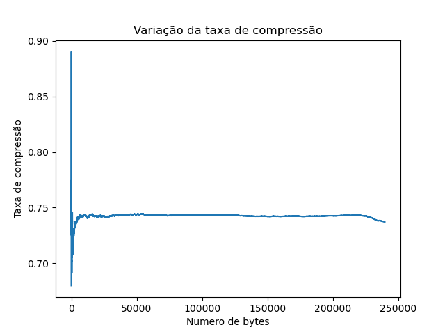

# Relatório dos testes no arquivo Descompressao variavel 9 livro
    
## Tabela dos dados
    
| Descrições | Estatísticas |
| --- | --- |
| Quantidade de valores | 239725 |
| Tempo de execução em segundos | 20.23 |
| Espaço gasto na árvore em kb | 67.48 |
| Numero total de nós | 1234 |
| Numero de elementos adicionados | 512 |
| Taxa final de compressão/descompressão | 0.74 |

    
## Gráfico da taxa de compressão
    

    